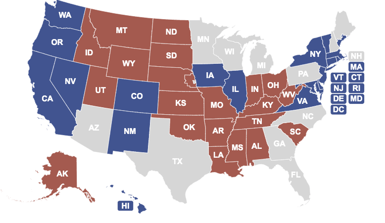

***

# Battleground/Swing States in American Politics



While voters from various states exhibit trends of selecting a candidate from a particular party in the presidential elections, there are those select few states where no single candidate may have garnered overwhelming support, resulting in a close race up until election night. The term "Swing State" [first emerged](https://books.google.com/ngrams/graph?content=battleground+states%2Cswing+states&year_start=1950&year_end=2008&corpus=15&smoothing=3&share=&direct_url=t1%3B%2Cbattleground%20states%3B%2Cc0%3B.t1%3B%2Cswing%20states%3B%2Cc0#t1%3B%2Cbattleground%20states%3B%2Cc0%3B.t1%3B%2Cswing%20states%3B%2Cc0) in politics around the 1960s but was replaced by "Battleground" in the early 2000s, reflecting the often tumultuous campaigning that will occur between leading candidates. In the above graphic, red and blue colors refer to regular Republican and Democratic strongholds, while grey represents the projected battleground states in 2020. Battleground states may change with election cycles due to demographic shifts in the voter pool or recent changes in other elections like gubernatorial and state legislative, but typically they are characterized by a margin of victory in a previous presidential election of less than 5%. In 2016, eleven states carried this distinction: CO, FL, IA, MI, MN, NV, NH, NC, OH, PA, and VA. In the upcoming 2020 election, key states such as PA, MI, and WI from the rust belt are considered to be [likely Battlegrounds](https://electoralvotemap.com), as well as southern states like FL. In 2016, Trump [won these three rust belt states](https://www.washingtonpost.com/graphics/politics/2016-election/swing-state-margins/) with an approxmiate total of 107,000 votes, which was only less than 1% of all votes in the election, but helped him clinch overall victory.

***

# Pennsylvania and Iowa

Pennsylvania has experienced [recent shifts in local level results](https://www.dailykos.com/stories/2017/11/9/1714253/-Pennsylvania-Democrats-flip-offices-for-first-time-since-1799-and-GOP-congressmen-could-be-next), as three regularly strong Republican counties all flipped blue. In Chester County, it was the first time Democrats won several key offices since 1799, and similarly in Bucks County, it was the first time Democrats won any countywide office except for county commissioner in 30 years. Pennsylvania's 2020 primary will be held Tuesday, April 28th.

Iowa is often considered to be a state of note, not only for its frequent battleground status but also because it hosts the [first caucus](https://www.uspresidentialelectionnews.com/2020-presidential-primary-schedule-calendar/) during a presidential election year, which will happen Monday, February 3rd. For the last 20 years, an Iowa winner (top 4 for their party) has gone on to [win the presidency](https://www.thewrap.com/how-good-are-the-iowa-caucuses-at-picking-presidential-nominees-pretty-good/). [Recent poll results](https://www.usatoday.com/story/news/politics/elections/2019/10/21/iowa-caucuses-pete-buttigieg-elizabeth-warren-joe-biden-top-poll/4025797002/) in October have shown a surprising jump by South Bend mayor Pete Buttigieg in Iowa, who has propelled himself into the top 3 leading candidates with 13%, following closely behind frontrunners Senator Elizabeth Warren at 17% and former Vice President Joe Biden at 18%.

```{r, echo = FALSE, include = FALSE}
library(tidyverse)
library(viridis)
library(plotly)
library(patchwork)
library(gtrendsR)

knitr::opts_chunk$set(
  echo = TRUE,
  warning = FALSE,
  fig.width = 10,
  fig.height = 6,
  out.width = "90%"
)
options(
  ggplot2.continuous.colour = "viridis",
  ggplot2.continuous.fill = "viridis"
)
scale_colour_discrete = scale_colour_viridis_d
scale_fill_discrete = scale_fill_viridis_d
theme_set(theme_minimal() + theme(legend.position = "right"))
```

```{r, echo = FALSE, include = FALSE}
president_primary_polls <- read_csv("./data/president_primary_polls.csv") 

president_primary_polls = 
  rename(president_primary_polls, Percent = pct)
```

***

# Polling in Important 2020 Election States

Democrats who are [currently leading the election field nationally](https://www.realclearpolitics.com/epolls/2020/president/us/2020_democratic_presidential_nomination-6730.html) include Biden, Sanders, Warren, and Buttigieg. These candidates are similarly topping the field in both [Iowa](https://www.realclearpolitics.com/epolls/2020/president/ia/iowa_democratic_presidential_caucus-6731.html) and [Pennsylvania](https://www.realclearpolitics.com/epolls/2020/president/pa/pennsylvania_democratic_presidential_primary-6860.html).


***

### Iowa
```{r, echo = FALSE, message = FALSE, warning = FALSE}
IA_plotly =
president_primary_polls %>%
  mutate(answer = fct_reorder(answer, Percent)) %>%
  filter(state == "Iowa",
         answer == c("Biden", "Warren", "Sanders", "Buttigieg")) %>%
  plot_ly(y = ~Percent, color = ~answer, type = "box", colors = "Set3") 
IA_plotly
```

Median polling results from 33 polls for leading candidates show Biden still ahead of the pack with 25 percentage points but also a large range of 20 points between lowest and highest predictions. Warren follows with a similarly wide range of 19 points. Just a 2 percentage point difference between her and Sanders may signify a tight race for second place. Buttigieg continues to lag behind these three but remains in double digits with 13 points, all the while exhibiting the lowest range in polls at only 9.6 between his highest and lowest predictions.

### Pennsylvania
```{r, echo = FALSE, message = FALSE, warning = FALSE}
PA_plotly =
president_primary_polls %>%
  mutate(answer = fct_reorder(answer, Percent)) %>%
  filter(state == "Pennsylvania",
         answer == c("Biden", "Warren", "Sanders", "Buttigieg")) %>%
  plot_ly(y = ~Percent, color = ~answer, type = "box", colors = "Set3")
PA_plotly
```

```{r, echo = FALSE, include = FALSE}
pa_polls = 
  president_primary_polls %>% 
  filter(state == "Pennsylvania")
```

The smaller sample size of polls (7) may make it difficult to accurately represent current candidate polling status, and this fewer number of polls could be attributed to Pennsylvania possessing a later primary (April 28th), which means it hasn't garnered as much attention for predictors. However, the overall field is exhibiting a similar trend to Iowa, as Biden leads the way with a median of `r (median(pull(filter(pa_polls, answer == "Biden"))))` percentage points among sampled polls. He is followed by Sanders and Warren, who again are polling quite close together at a median of 9.5 and 8 percentage points, respectively. Buttigieg does not trail by much any longer, as he is showing a median of `r (median(pull(filter(pa_polls, answer == "Buttigieg"))))` percentage points. This means that the 2nd through 4th place candidates are all within 3 points of each other.

***

# Google Trends By State

```{r, echo = FALSE, include = FALSE}
clean_google = function(df) {
  
  df %>% 
  select(c(-geo, -time, -gprop, -category)) %>% 
  mutate(
    date = as.Date(date),
    hits = str_replace(hits, "<1", "0.5"),
    hits = as.numeric(hits)
  )
    
}

iowa = (gtrends(c("bernie sanders", "elizabeth warren", "joe biden", "pete buttgieg"), geo = "US-IA", time = "2019-02-03 2019-11-03")$interest_over_time) %>%
  clean_google()

penn = (gtrends(c("bernie sanders", "elizabeth warren", "joe biden", "pete buttgieg"), geo = "US-PA", time = "2019-02-03 2019-11-03")$interest_over_time) %>%
  clean_google()

```


```{r, echo = FALSE}
options(
  ggplot2.continuous.colour = "viridis",
  ggplot2.continuous.fill = "viridis"
)
scale_colour_discrete = scale_colour_viridis_d
scale_fill_discrete = scale_fill_viridis_d
theme_set(theme_minimal() + theme(legend.position = "right"))

iowa_plot =
  iowa %>%
  group_by(keyword) %>%
  ggplot(aes(x = date, y = hits, color = keyword)) + geom_point() +
  geom_path() +
  theme(axis.text.x = element_text(angle = 45, hjust = 1)) +
  labs(title = "Iowa",
       x = "",
       y = "Relative Search Proportion",
       color = "Search Query") +
  geom_vline(xintercept = as.numeric(as.Date(c("2019-06-26", "2019-07-30", "2019-09-12", "2019-10-15"))), linetype = 4, color = "blue") +
  annotate("text", x = as.Date(c("2019-06-26", "2019-07-30", "2019-09-12", "2019-10-15")), y = 85, label = c("Debate 1", "Debate 2", "Debate 3", "Debate 4"), size = 3) 

penn_plot =
  penn %>%
  group_by(keyword) %>%
  ggplot(aes(x = date, y = hits, color = keyword)) + geom_point() +
  geom_path() +
  theme(axis.text.x = element_text(angle = 45, hjust = 1)) +
  labs(title = "Pennsylvania",
       x = "Date",
       y = "Relative Search Proportion",
       color = "Search Query") +
  geom_vline(xintercept = as.numeric(as.Date(c("2019-06-26", "2019-07-30", "2019-09-12", "2019-10-15"))), linetype = 4, color = "blue") +
  annotate("text", x = as.Date(c("2019-06-26", "2019-07-30", "2019-09-12", "2019-10-15")), y = 85, label = c("Debate 1", "Debate 2", "Debate 3", "Debate 4"), size = 3) 

iowa_plot / penn_plot
```

Between Iowa and Pennsylvania, there are consistent spikes in relative search queries for the three leading candidates: Biden, Sanders, and Warren. Not only does each individual's proportion of searches spike at similar time points in each state, but spikes for all three candidates seem to coincide, suggesting that voters are engaging in searches for numerous candidates at similar times. Sanders experienced significant popularity in relative searches in early spring and in October, likely around the time of the fourth debate. In spring in both states, he reached a [relative search proportion of 100](https://medium.com/google-news-lab/what-is-google-trends-data-and-what-does-it-mean-b48f07342ee8), which indicates the greatest proportion of all Google searches that one of these four queries constituted on a single day during the period of interest. Biden experienced his greatest spikes in voter search queries later in the spring compared to Sanders, potentially due to debate 1 proceedings. Warren did not exhibit any significant spikes in search queries but has seen a steady increase in relative search proporiton over time, at least in Iowa. Both Biden and Sanders have also experienced steady overall increases in relative search proportions over time in Iowa, while in Pennsylvania they've ultimately leveled off. All three saw relative search increases around the second debate in July. Buttigieg however has not been prominent in search queries at any point over the course of the year in either state, despite his recent positive polling results in Iowa. Overall for the top 3 candidates, changes in relative search results in both states likely have reflected major events in the democratic race thus far, but search queries towards the end of this year do not reflect any clear preference in candidates.