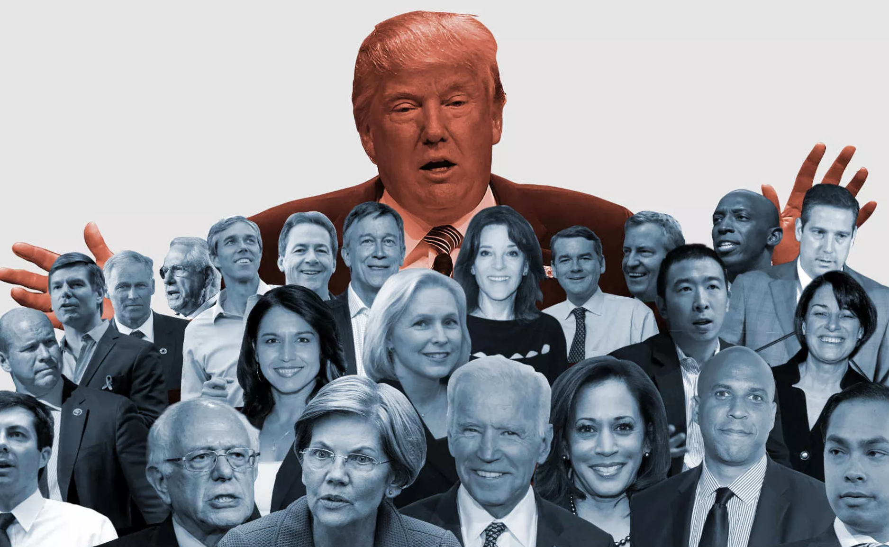

*Image source:* [Vox](https://www.vox.com/policy-and-politics/2019/4/26/18512479/2020-primary-campaign-policy-ideas) 

# Motivation

A highly anticipated presidential election is less than one year away, with the first primary votes happening in Iowa in just two months. We were interested in exploring factors that affect candidate popularity in the 2020 democratic primary over the last year in order to better understand how candidates might perform in upcoming votes. We thought that factors such as debate performance and campaign events might help explain fluctuations in the polls or a particular candidates' success. In order to assess candidate popularity we chose to use polling data as an indicator of potential election success as well as Google Trends data. We wanted to assess the impacts of debate performance, measured by variables such as speaking time, as well as examine trends in polling and google searches of candidates after newsworthy events at the state and national level. 

# Exploratory Analyses

This website includes exploratory analyses on the following four topics:

* *[Key Events:](https://tlayouni.github.io/debate_impact.github.io/key_variables.html)* This page examines key campaign events from January 2019 to November 2019, including controversies and endorsements that may have impacted 3 of the frontrunner candidates during their bids for the Democratic Nomination for President in 2020, Former Vice President Joe Biden, Senator Elizabeth Warren and Senator Bernie Sanders. We look at how these events might be associated with polling performance.

* *[The Fourth Debate:](https://tlayouni.github.io/debate_impact.github.io/dashboard.html)* This dashboard focuses on the fourth debate. The plots included in the dashboard show the relationship between select debate indicators- words spoken, airtime, Trump mentions, and candidate attacks- and the percent change in polling performance before and after the debate.

* *[Google Trends:](https://tlayouni.github.io/debate_impact.github.io/google_trends.html)* We explored Google Search behavior as a secondary indicator of the impact that debate performance has on public perceptions of Democratic presidential candidates. This page shows how key events that we chose from each debate are association with Google Search behavior in the days immediately following the debates. 

* *[Battleground States:](https://tlayouni.github.io/debate_impact.github.io/Battleground.html)* There is significant interest in which democratic candidate will eventually go head to head with President Trump in the 2020 presidential election, so we explored polling results in two key states, IA and PA. This page looks at Google Search behavior following debates at the national level, and explores how searches for these top candidates varied (or didn’t) between the two states over the course of this year to see if fluctuations in polling performance coincided with key events like debates.

An overview of this project can be viewed through our [Screencast](https://www.youtube.com/watch?v=UeGHCQQLmTA), located on Youtube.